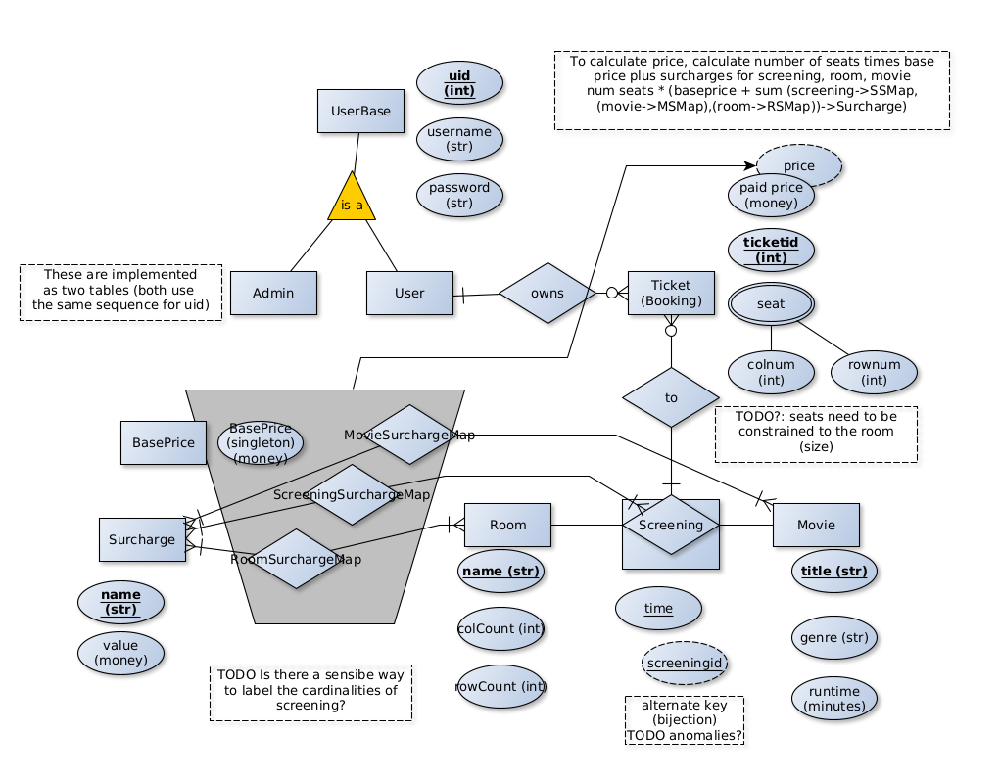

### Index
- [Requirements](docs/README-REQUIREMENTS.md)
- [Plan](docs/Plan.md)

### Building
- I've only gotten builds to work with the IntelliJ IDEA build system and it requries some fiddling.
  - Accidentally did a maven clean and couldnt remember how to rebuild
  - The correct subset of cucumber needs to be manually built for some reason or something
    - IDK why I didnt need to rebuild mockito after the clean
  - After refreshing maven, the h2 needs to be removed from the ticket-service library list and the module added so that the version built from source is used

### ER Diagram

- the core is the movie-screening-room axis the way I put it together
- a screening is keyed as movie in a room at a given time(per spec)
- a movie is keyed by title (per specification), and has genre and duration
- a room is keyed by name (per spec) and has a seating grid size
- a booking is keyed by the composite screening key, but i add a derived bijection to the screening which is the screeningId
  so a booking has a screening, and a set of seats
thats the basic data i guess
- next to that, comes the pricing stuff. a booking's price should not change when pricing components are changed, so it has the price stored on it
- price is calculated (by calculating the price of each seat at the sum of) from the singleton value in BasePrice (modifiable), and by adding the room, screening, and movie price components (surcharges)
- surcharges are keyed by name (per spec) in Surcharge, and have a value
- the mapping tables attach surcharges to room, movie, spec respectively using their keys
- so the big gray box is stuff that is calculated into the permanently stored price (this is more a business logic than a DB thing)
- users can create bookings, so users have a one to many relationship to bookings
- the user/admin subset of the diagram is that baseusers have a username and a password, but I want to store admin and users in two separate tables so I diagram the commonality as IsA
and normal users have the additional capability as above of creating bookings (but admins dont) (per spec) (and this is one of the reasons why I decided to split the table)

### Notes

#### Infra
- Podman temporary postgres bringup:
  (on windows with WSL; `podman machine start` if stopped)
  (NOTE: bind to an ip otherwise it will be publicly exposed on all interfaces, bypassing the firewall.)
  ```
  podman run -it --rm -p 127.0.0.1:9001:5432 -e POSTGRES_USERNAME=postgres -e POSTGRES_PASSWORD=postgres -e POSTGRES_DB=cinema postgres
  ```
- run `mvn package -Dmaven.test.skip` against `ticket-service` (make sure), to build jar usable for acceptance tests
  - `mvn package -pl ticket-service -am -Dmaven.test.skip`
  - TODO: is there no easier way to do this?
#### Maven
- Spring Boot starters can be found at https://github.com/spring-projects/spring-boot/tree/main/spring-boot-project/spring-boot-starters
- TODO spring starter vs spring boot starter?
- We get access to our dependency specifications via (in ticket-service-parent/pom.xml):
  ```xml
    <parent>
        <groupId>org.springframework.boot</groupId>
        <artifactId>spring-boot-starter-parent</artifactId>
        <!-- DO NOT MODIFY THIS VERSION! -->
        <version>2.7.17</version>
    </parent>
  ```
  which specifies
  ```xml
  <parent>
    <groupId>org.springframework.boot</groupId>
    <artifactId>spring-boot-dependencies</artifactId>
    <version>2.7.17</version>
  </parent>
  ```
  which adds dependencies to `<dependencyManagement>`, i.e. we don't immediately
  inherit all dependencies, but we can specify them in our own `<dependency>` tags.
  This is also somewhat mentioned, and the versions are also listed at https://docs.spring.io/spring-boot/docs/current/reference/html/dependency-versions.html (for a given version)
  See also https://stackoverflow.com/questions/38882221/how-to-inherit-dependency-from-a-parent-pom-to-a-child-pom .
- TODO what happens if say, spring-shell-starter is pinned to a version but it's dependencies have different versions in spring-boot-starter-parent?
- Dependency scopes https://www.baeldung.com/maven-dependency-scopes
- maven multi-module; https://www.baeldung.com/maven-multi-module https://maven.apache.org/guides/mini/guide-multiple-modules.html
- Surefire: https://maven.apache.org/surefire/maven-surefire-plugin/ https://www.baeldung.com/maven-surefire-plugin
#### Lombok
- Lombok refresher https://www.baeldung.com/intro-to-project-lombok (though really you should just check the docs)
  - https://projectlombok.org/features/configuration `lombok.addLombokGeneratedAnnotation = true`
    We use this annotation for something related to tests as specified here?
  - delombok something https://projectlombok.org/setup/maven
#### Spring
###### Sec.
- https://www.baeldung.com/spring-security-integration-tests
###### Yaml
- [Spring Profiles Mess](docs/notes-yaml.md)
#### H2
- h2 over file: https://www.youtube.com/watch?v=8QBJMxyXIqc  Spring Boot Java H2 Database Setup in IntelliJ (Dan Vega)
  - http://h2database.com/html/features.html#auto_mixed_mode
- sticking the db file in some known location 
  - https://stackoverflow.com/questions/13354531/maven-project-build-directory/13356378#13356378
  - https://docs.spring.io/spring-boot/docs/1.4.x/reference/html/howto-properties-and-configuration.html#howto-automatic-expansion-maven
#### Tests
- We dont add jacoco reporting because we can look at the result in intellij?
  - can right click on the tests/java directory and then "run all tests with coverage"
#### SQL / JPA / Hibernate
- If you get weird errors make sure you arent using any reserved words as field names. The ORM dialect should really take care of this. -_-
- Column name processing (for constraints?) is weird, for columns inline and @Embeddable in the class, you have to use the inline column name, but for things like foreign keys that get swapped in for entities, (?) you have to use the database name
#### Misc
- Some hibernate back-and-forth https://news.ycombinator.com/item?id=26772550
- git
  - `git log -p 23-24-tuesday-group..HEAD -- ':(exclude)final/docs/notes-yaml.md'`
- `mvn clean verify`

### Reference
Ezek nem helyettesítik az anyagot de jók ismétlésnek/kiegészítőnek azt hiszem;
- https://www.youtube.com/watch?v=9SGDpanrc8U "Spring Boot Tutorial | Full Course [2023] [NEW]" (AmigosCode)
- https://www.youtube.com/watch?v=Geq60OVyBPg Software Testing Tutorial - Learn Unit Testing and Integration Testing (Amigoscode) (2021)
  (nem igaz, nincs benne integrációs tesztelés)
- https://www.youtube.com/watch?v=N6ZaSNhzsGo Spring Boot Testing Mini-Series #6: Integration Tests (code with arho) (2022)
- https://www.youtube.com/watch?v=Ae5ukd136pc  Spring Boot Testing Mini-Series Part #1: Unit Testing  (code with arho) (2021)
- https://www.youtube.com/watch?v=6Os6nL7TtAY Spring Tips: Spring Shell and Spring Native (SpringDeveloper ; Josh Long (starbuxman)) (2022)
- https://www.youtube.com/watch?v=xEnvAAhMGu4 Spring Security Patterns (SpringDeveloper / két spring security maintainer) ! 2020
  (még egy, el megy egynek.. - https://www.youtube.com/watch?v=h-9vhFeM3MY Spring Security Architecture Explained (AmigosCode) (2023))
  jó videó de 2020 óta sok spring security release volt és nem tudom hogy mennyire elavult
- https://www.youtube.com/watch?v=8SGI_XS5OPw Spring Boot Tutorial | Spring Data JPA | 2021 (Amigoscode)
  ezt nem ellenőriztem
- https://www.youtube.com/watch?v=CT8dbbe783s  10 Spring and Spring Boot Common Mistakes You Need To STOP  (Amigoscode) (2023)

Egyébként meg elég alaposnak tűnnek a dokumentációk.

A SpringDeveloper-en elég jó dolgok vannak.

### Jó példa megközelítések
-  `23-24-tuesday-group` és `23-24-tuesday-group` branchek
- https://github.com/MrExplode/epam-deik-java-dev/
- ? https://github.com/Lyyzar/epam-film-app/
